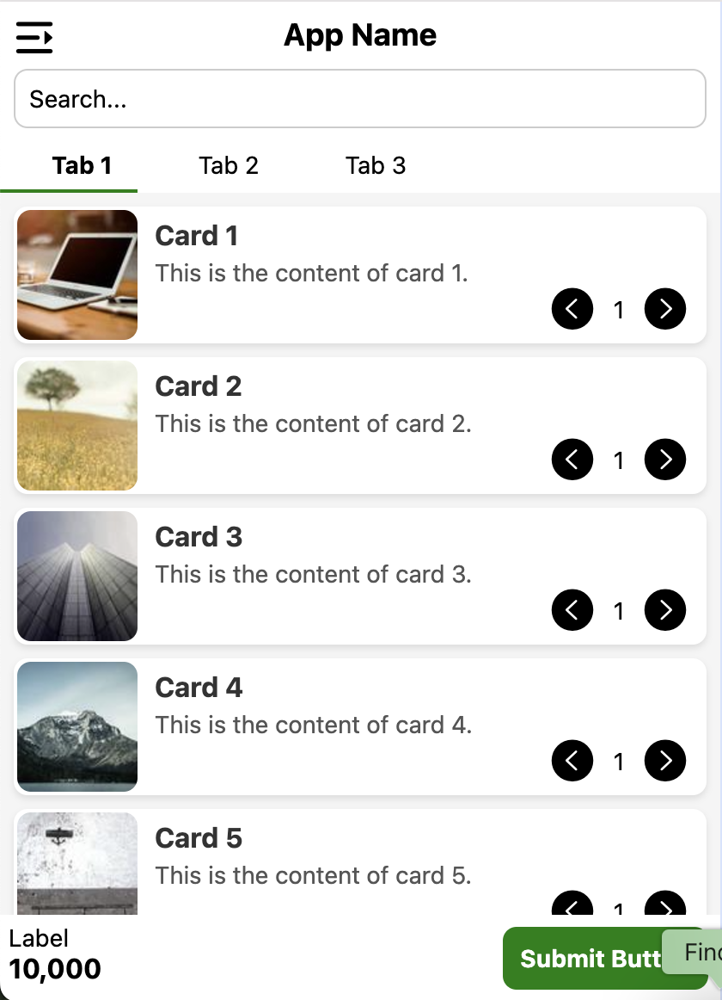

# Green-Milo

**Green-Milo** is a design system providing modern, reusable, and customizable UI components for React Native and Expo projects. Designed for flexibility and simplicity, developers can easily integrate components by copying and pasting them into their own projects.

## Features

- **Ready-to-Use Components**: No need for additional installations or dependencies.
- **Customizable**: Modify components to suit your project's design requirements.
- **Cross-Platform**: Compatible with iOS, Android, and Web using React Native and Expo.

## Components Directory

The `components` folder includes the following ready-to-use components:

```plaintext
components/
├── Button.js       # A customizable button component
├── Card.js         # A card layout for displaying content
├── Drawer.js       # A drawer navigation component
├── Filler.js       # A filler component for spacing and layout adjustments
├── Flex.js         # A flexbox layout utility
├── index.js        # Component entry point for easy imports
├── Label.js        # A label component for form inputs and UI elements
├── Navigation.js   # A navigation utility for screens
├── Popup.js        # A popup/modal dialog component
├── Search.js       # A search bar component
└── Tabs.js         # A tab navigation component
```




## Usage

1. Navigate to the `components` directory:

   ```bash
   cd components
   ```

2. Copy the required component(s) to your project. For example:

   ```bash
   cp Button.js /path/to/your/project/components/
   ```

3. Import and use the component in your project:

   ```javascript
   import Button from './components/Button';

   const App = () => (
     <Button title="Click Me" onPress={() => alert('Hello, Green-Milo!')} />
   );

   export default App;
   ```

4. Repeat for any additional components you want to use.

## Running Your Project

Once the components are integrated into your project, use Expo to run it on your desired platform:

- **Start the app**:

  ```bash
  expo start
  ```

- Use the Expo Go app or emulator to preview your project.

## License

This project is licensed under the [MIT License](LICENSE).

---

Green-Milo makes it easy to integrate prebuilt, customizable components into your React Native projects. Copy, paste, and start building!